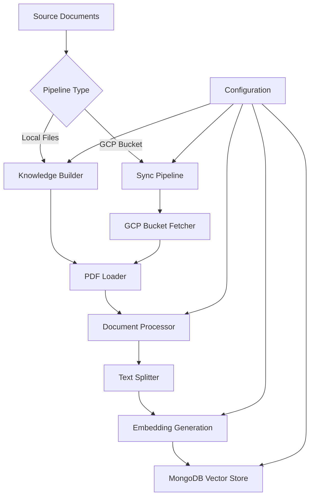
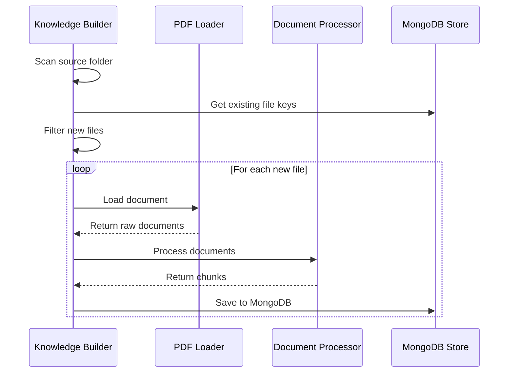
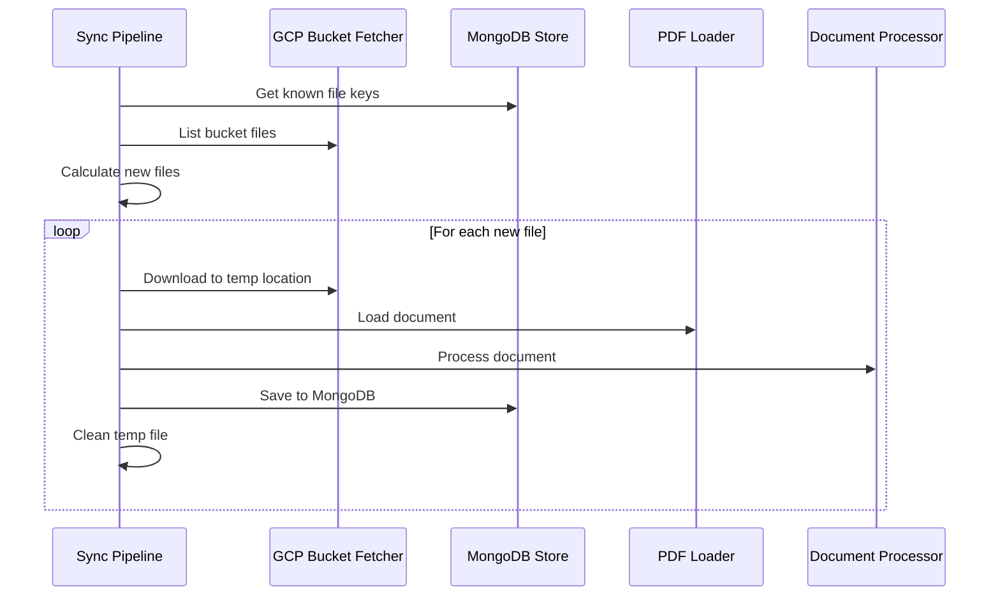

# Document Ingestion System

## Overview

The document ingestion system is responsible for processing, embedding, and storing documents in the knowledge base. It supports two main pipelines for different use cases and provides a flexible, modular architecture for handling various document types and storage backends.

## System Architecture



## Core Components

### Interfaces

The system is built on a set of abstract interfaces that enable modularity and extensibility:

```python
# Document processing pipeline interfaces
DocumentLoader      # Loads raw documents from files
DocumentProcessor   # Processes and splits documents into chunks
DocumentStore      # Stores processed documents with embeddings
Fetcher            # Fetches documents from remote sources
```

### Loaders

#### PDF Loader
- **Purpose**: Extract text content from PDF documents
- **Features**:
  - Page-by-page processing
  - Metadata extraction (title, description, page count)
  - Text extraction using PyMuPDF (fitz)
  - Preserves document structure and page numbers

```python
class PDFLoader(DocumentLoader):
    def load(self, path: str) -> List[CustomDocument]:
        # Extracts text from each page
        # Preserves metadata and page numbers
        # Returns structured document objects
```

### Processors

#### Document Processor
- **Purpose**: Split documents into manageable chunks for embedding
- **Configuration**:
  - Chunk size: 1000 characters
  - Chunk overlap: 200 characters
- **Features**:
  - Recursive character-based splitting
  - Metadata preservation
  - Optimized for semantic coherence

```python
class DocumentProcessorImpl(DocumentProcessor):
    def __init__(self):
        self.splitter = RecursiveCharacterTextSplitter(
            chunk_size=1000,
            chunk_overlap=200
        )
```

### Storage

#### MongoDB Vector Store
- **Purpose**: Store document embeddings with vector search capabilities
- **Features**:
  - Vector similarity search using cosine similarity
  - Metadata indexing for filtering
  - Automatic collection management
  - Integration with LangChain ecosystem

```python
class MongoAtlasVectorStore(DocumentStore):
    # MongoDB Atlas integration
    # Vector search index creation
    # Document embedding storage
    # Duplicate prevention
```

## Pipelines

### 1. Knowledge Builder Pipeline

**Use Case**: Process documents from local folders (initial setup, bulk imports)

#### Features
- Local file system processing
- Batch processing of multiple documents
- Incremental updates (only new files)
- Collection management (create, clear, use existing)

#### Usage

```bash
# Basic usage
uv run -- python -m ingestion.knowledge_builder \
  --source-folder ./documents

# With custom collection
uv run -- python -m ingestion.knowledge_builder \
  --source-folder ./pdfs \
  --collection-name university_docs \
  --use-existing-collection

# Clear existing data first
uv run -- python -m ingestion.knowledge_builder \
  --source-folder ./documents \
  --clear-collection-before
```

#### Command Line Arguments

| Argument | Required | Description |
|----------|----------|-------------|
| `--source-folder` | Yes | Path to folder containing documents to process |
| `--collection-name` | No | MongoDB collection name (overrides config default) |
| `--use-existing-collection` | No | Allow using existing collection |
| `--clear-collection-before` | No | Clear collection before processing |

#### Processing Flow



### 2. Sync Pipeline

**Use Case**: Continuous synchronization from Google Cloud Storage (production updates)

#### Features
- Automatic detection of new files
- Cloud storage integration
- Incremental synchronization
- Temporary file handling

#### Usage

```bash
# Basic sync
uv run -- python -m ingestion.sync_pipeline

# With collection options
uv run -- python -m ingestion.sync_pipeline \
  --use-existing-collection \
  --clear-collection-before
```

#### Command Line Arguments

| Argument | Required | Description |
|----------|----------|-------------|
| `--use-existing-collection` | No | Allow using existing collection |
| `--clear-collection-before` | No | Clear collection before sync |

#### Processing Flow



## Configuration

### Environment Configuration

The system uses a centralized configuration system located in `ingestion/config.py`:

```python
class Config:
    # Text Splitting Configuration
    splitter = SplitterConfig(
        CHUNK_SIZE=1000,        # Characters per chunk
        CHUNK_OVERLAP=200       # Overlap between chunks
    )
    
    # MongoDB Configuration
    mongo = MongoConfig(
        URI="mongodb://...",           # Connection string
        DB_NAME="assistant",           # Database name
        COLLECTION_NAME="knowledge",   # Collection name
        VECTOR_SEARCH_INDEX_NAME="embedding"  # Vector index
    )
    
    # GCP Configuration
    gcp = GCPConfig(
        BUCKET_NAME="ai-assistant-dev-docs",  # GCS bucket
        PREFIX=""                             # Optional prefix
    )
    
    # Embedding Model
    embedding = "gemini-embedding-001"
```

### Required Secrets

The following secrets must be configured (typically in Google Secret Manager):

- `MONGO_URI`: MongoDB Atlas connection string
- Google Cloud credentials for GCS access and Secret Manager
- Vertex AI credentials for embeddings

### Collection Management

#### Collection Creation Options

1. **Auto-create**: Default behavior, creates new collection
2. **Use existing**: `--use-existing-collection` flag
3. **Clear before**: `--clear-collection-before` flag

#### Vector Index Configuration

- **Index Type**: Vector search index
- **Dimensions**: Determined by embedding model (e.g., 768 for Gemini)
- **Similarity Metric**: Cosine similarity
- **Index Name**: Configurable in settings

## Document Processing Details

### Document Structure

Documents are processed into a standardized format:

```python
@dataclass
class CustomDocument:
    file_path: str           # Original file path/identifier
    title: str              # Document title (from metadata)
    content: str            # Extracted text content
    short_description: str  # Document description
    page_number: int        # Page number within document
    page_count: int         # Total pages in document
```

### Chunking Strategy

- **Method**: Recursive Character Text Splitter
- **Chunk Size**: 1000 characters (configurable)
- **Overlap**: 200 characters (ensures context continuity)
- **Metadata Preservation**: All original metadata maintained

### Embedding Generation

- **Model**: Gemini Text Embedding (gemini-embedding-001)
- **Dimensions**: 768
- **Provider**: Google Vertex AI
- **Optimization**: Batch processing for efficiency

## Error Handling and Monitoring

### Logging Configuration

```python
# Structured logging with timestamps
logging.basicConfig(
    level=logging.INFO,
    format="%(asctime)s [%(levelname)s] [%(name)s:%(funcName)s:%(lineno)d]\t%(message)s",
    datefmt="%Y-%m-%d %H:%M:%S"
)
```

### Common Error Scenarios

1. **File Access Errors**
   - Invalid file paths
   - Permission issues
   - Corrupted PDF files

2. **Database Connection Issues**
   - MongoDB connection failures
   - Authentication problems
   - Network connectivity

3. **Processing Errors**
   - Unsupported file formats
   - Memory limitations
   - Embedding generation failures

### Monitoring Metrics

Key metrics to monitor:
- Documents processed per hour
- Processing success/failure rates
- Average processing time per document
- Storage usage growth
- Embedding generation costs

## File Format Support

### Currently Supported

- **PDF**: Full support with page-level processing
  - Text extraction
  - Metadata preservation
  - Multi-page handling

### Planned Extensions

- **DOCX**: Microsoft Word documents
- **TXT**: Plain text files
- **MD**: Markdown files
- **HTML**: Web pages and documentation

## Best Practices

### File Organization

Recommended folder structure for Knowledge Builder:

```
documents/
├── policies/
│   ├── student_handbook.pdf
│   └── academic_regulations.pdf
├── procedures/
│   ├── admission_process.pdf
│   └── graduation_requirements.pdf
└── forms/
    ├── application_form.pdf
    └── transcript_request.pdf
```

### Performance Optimization

1. **Batch Processing**: Process multiple files in single runs
2. **Incremental Updates**: Only process new/changed files
3. **Resource Management**: Monitor memory usage for large files
4. **Parallel Processing**: Consider parallel processing for large batches

### Quality Assurance

1. **Document Validation**: Verify text extraction quality
2. **Metadata Verification**: Ensure proper metadata capture
3. **Chunking Review**: Validate chunk boundaries and overlap
4. **Embedding Quality**: Test similarity search results

## Troubleshooting

### Common Issues

#### "Collection already exists" Error
```bash
# Solution: Use existing collection flag
--use-existing-collection
```

#### "No documents found" Warning
- Verify folder contains supported files (PDF)
- Check file permissions
- Ensure files are not corrupted

#### Connection Errors
- Verify MongoDB connection string
- Check network connectivity
- Validate authentication credentials

#### Memory Issues
- Process files in smaller batches
- Monitor system resources
- Consider increasing available memory

### Debugging Commands

```bash
# Test MongoDB connection
uv run -- python -c "from ingestion.stores.mongo_store import MongoAtlasVectorStore; store = MongoAtlasVectorStore(); print('Connected successfully')"

# Verify embeddings
uv run -- python -c "from ingestion.utils.components import get_embeddings; embed, dim = get_embeddings(); print(f'Embedding dimension: {dim}')"

# Check GCP access
uv run -- python -c "from ingestion.storage_fetchers.gcp_bucket_fetcher import GCPBucketFetcher; fetcher = GCPBucketFetcher('bucket-name'); print(len(fetcher.list_files()))"
```

## Development and Extension

### Adding New Document Types

1. **Create Loader**: Implement `DocumentLoader` interface
2. **Register Processor**: Ensure processor handles new document type
3. **Update Configuration**: Add any format-specific settings
4. **Test Integration**: Verify end-to-end processing

### Custom Storage Backends

1. **Implement Interface**: Create class implementing `DocumentStore`
2. **Configuration**: Add connection and configuration options
3. **Testing**: Verify storage and retrieval functionality
4. **Integration**: Update pipeline initialization

### Extending Fetchers

1. **Implement Protocol**: Follow `Fetcher` protocol
2. **Authentication**: Handle source-specific auth
3. **Error Handling**: Robust error management
4. **Testing**: Verify file listing and fetching

## Production Deployment

### Infrastructure Requirements

- **MongoDB Atlas**: Vector search enabled cluster
- **Google Cloud Storage**: For document storage
- **Compute Resources**: Sufficient memory for document processing
- **Network**: Reliable connectivity to cloud services

### Deployment Checklist

- [ ] Configure MongoDB connection strings
- [ ] Set up GCP service account credentials
- [ ] Verify Secret Manager access
- [ ] Test document processing pipeline
- [ ] Monitor resource usage and performance
- [ ] Set up logging and monitoring
- [ ] Configure backup and recovery procedures

### Scaling Considerations

- **Horizontal Scaling**: Multiple processing instances
- **Batch Size Optimization**: Tune for available resources
- **Caching**: Cache frequently accessed configurations
- **Load Balancing**: Distribute processing load
- **Resource Monitoring**: Track CPU, memory, and storage usage
