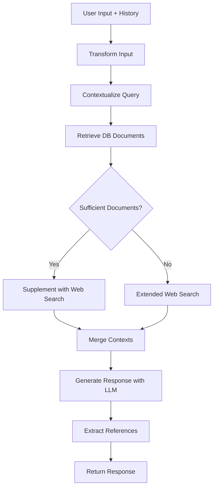

# Knowledge Agent Documentation

## Overview

The Knowledge Agent is a sophisticated AI assistant that combines internal knowledge retrieval with optional web search to provide comprehensive, well-sourced answers. It's specifically designed for domain-specific applications and integrates multiple retrieval strategies to ensure high-quality responses.

## Architecture

### Core Components

- **Base Agent**: Abstract foundation providing common invoke patterns (sync/async, streaming)
- **Knowledge Agent**: Main implementation handling retrieval and response generation
- **Contextualizer Agent**: Processes conversation history and contextualizes user queries
- **Retrievers**: Database and web search retrieval systems
- **Relevance Checker**: Determines if retrieved documents are relevant to the query

### Key Features

- **Multi-source Retrieval**: Combines internal database documents with web search results
- **Contextual Processing**: Uses conversation history to understand user intent
- **Smart Web Search**: Conditionally performs web searches based on database relevance
- **Source Attribution**: Tracks and provides references for all information sources
- **Streaming Support**: Real-time response generation for better user experience

## Workflow



## Configuration

### Knowledge Agent Parameters

```python
KnowledgeAgent(
    llm=get_llm(),                      # Language model instance
    domain_context="Your domain",       # Domain-specific context
    db_retriever=MongoRetriever(),      # Database retriever
    web_search_retriever=TavilyRetriever(), # Optional web search
    db_top_k=5,                        # Max DB documents to retrieve
    web_max_k=3,                       # Max web search results
    web_supplement_k=2,                # Web docs for supplementation
    verbose=True                       # Enable detailed logging
)
```

### Configuration Options

| Parameter | Type | Default | Description |
|-----------|------|---------|-------------|
| `llm` | BaseLanguageModel | Required | The language model for response generation |
| `domain_context` | str | Required | Specific domain context for the agent |
| `db_retriever` | BaseRetriever | Required | Database document retriever |
| `web_search_retriever` | BaseRetriever | None | Optional web search retriever |
| `db_top_k` | int | 5 | Number of documents to retrieve from database |
| `web_max_k` | int | 5 | Maximum web search results when DB is insufficient |
| `web_supplement_k` | int | 2 | Web search results for supplementing good DB results |
| `verbose` | bool | False | Enable detailed logging for debugging |

## Usage Examples

### Basic Setup

```python
from bll.agents.knowledge import Knowledge

# Initialize the knowledge agent (pre-configured for University of Obuda)
agent = Knowledge()

# Simple query
response = agent.invoke({
    "messages": [
        HumanMessage(content="What are the graduation requirements?")
    ]
})
```

### Custom Configuration

```python
from bll.agents.knowledge_agent.knowledge_agent import KnowledgeAgent
from core.utils.components import get_llm
from dal.mongo_db import MongoRetriever
from dal.tavily_websearch import TavilyRetriever

agent = KnowledgeAgent(
    llm=get_llm(),
    domain_context="Healthcare and medical information",
    db_retriever=MongoRetriever("medical_knowledge"),
    web_search_retriever=TavilyRetriever(
        include_domains=["pubmed.gov", "who.int", "cdc.gov"]
    ),
    db_top_k=7,
    web_max_k=4,
    web_supplement_k=2,
    verbose=True
)
```

### Streaming Responses

```python
# Stream responses for real-time interaction
async for chunk in agent.astream({
    "messages": [
        HumanMessage(content="Explain the admission process")
    ]
}):
    if "answer" in chunk:
        print(chunk["answer"].content, end="")
```

## Internal Processing

### 1. Input Transformation
- Extracts user prompt and conversation history from messages
- Adds domain context for proper scoping

### 2. Query Contextualization
- Uses ContextualizerAgent to process conversation history
- Creates contextual prompt that considers previous interactions

### 3. Database Retrieval
- Searches internal knowledge base using vector similarity
- Retrieves top-k most relevant documents
- Tags documents with "internal" source type

### 4. Conditional Web Search
- Evaluates if database results are sufficient
- Performs web search based on relevance threshold
- Uses domain-specific search domains when configured
- Tags web documents with "web" source type

### 5. Context Merging
- Combines internal and web documents
- Adds source information and page numbers
- Creates structured context for LLM processing

### 6. Response Generation
- Uses domain-aware system prompt
- Incorporates all retrieved context
- Generates comprehensive response with source attribution

## Response Format

### Output Structure
```python
{
    "answer": "Generated response with markdown formatting",
    "context": "Merged context from all sources",
    "db_docs": [Document, ...],     # Internal documents used
    "web_docs": [Document, ...],   # Web documents used
}
```

### Source Attribution
- Internal sources: `filename.pdf#page=X`
- Web sources: Full URL with title
- Automatic reference extraction and formatting

## Best Practices

### Performance Optimization
- Use appropriate `db_top_k` values (3-7 typically optimal)
- Configure web search domains to reduce noise
- Enable caching for frequently accessed queries
- Monitor token usage for cost optimization

### Quality Improvement
- Provide specific domain context
- Use high-quality, domain-relevant training data
- Regularly update knowledge base with new documents
- Fine-tune relevance thresholds based on use case

### Error Handling
- Graceful degradation when retrievers fail
- Fallback to pure LLM knowledge when no sources available
- Clear error messages for configuration issues
- Logging for debugging and monitoring

## Integration with FastAPI

```python
from fastapi import FastAPI
from bll.agents.knowledge import Knowledge

app = FastAPI()
knowledge_agent = Knowledge()

@app.post("/ask")
async def ask_question(request: RequestModel):
    response = await knowledge_agent.ainvoke({
        "messages": [msg.to_langchain_message() for msg in request.messages]
    })
    return {"answer": response["answer"]}
```

## Monitoring and Debugging

### Logging
- Enable `verbose=True` for detailed operation logs
- Monitor retrieval quality and relevance scores
- Track response times for performance optimization

### Key Metrics to Monitor
- Database retrieval success rate
- Web search API usage and costs
- Average response time
- User satisfaction with source relevance

## Troubleshooting

### Common Issues

1. **No relevant documents retrieved**
   - Check database content and indexing
   - Verify embedding model compatibility
   - Adjust similarity thresholds

2. **High web search API costs**
   - Implement caching for frequent queries
   - Adjust `web_max_k` and `web_supplement_k` parameters
   - Use more specific domain filters

3. **Poor response quality**
   - Review domain context specificity
   - Check document chunking and preprocessing
   - Validate LLM model selection and parameters

4. **Slow response times**
   - Optimize database queries and indexing
   - Implement async processing where possible
   - Consider response caching strategies

## Future Enhancements

- **Semantic Caching**: Cache similar queries using embeddings
- **Dynamic Domain Selection**: Context-aware domain filtering
- **Multi-modal Support**: Image and audio document processing
- **Feedback Integration**: Learn from user interactions
- **Advanced RAG**: Implement query rewriting and result re-ranking
